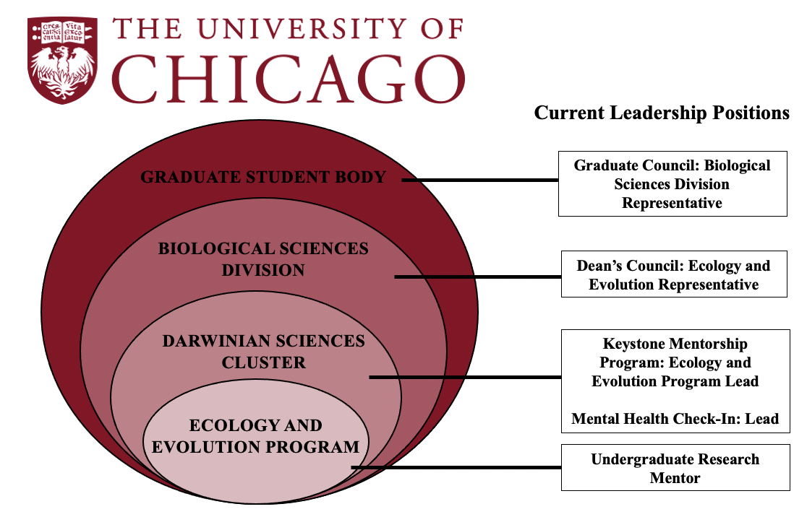

## Community Betterment

As a queer woman in STEM, I have experienced both discrimination and a lack of representation, which fuels feelings of self-doubt and imposter syndrome. My determination to empower myself as a cutting-edge computational ecologist has led me to develop a passion for bettering academic spaces to give all young scientists the best possible environment to thrive. To that end, I current occupy leadership positions in a number of campus initiatives from the program- to entire graduate student- level that allow me to make positive, lasting change in my community.

### Graduate Council: Biological Sciences Division Representative
As the BSD Rep on Graduate Council, I am one of 33 elected representatives from the university's 12 graduate schools and divisions. My role is to advocate the needs and passions of members of my division by disseminating important information and voting across a range of topics related to the graduate student experience. Being a member of student government also gives me a unique experience to gain leadership skills including legislation development, grant application review, and acting as a liason.

As a representative, I sit on the Health & Wellness Committee, where I work in a small team to create and implement programming aimed at improving community well-being. Projects I have worked on include Financial and Food Security Workshops, providing plants and UV lights to students to combat seasonal depression, and organizing virtual exercise programs during the COVID-19 pandemic. I am currently campaigning to become the Vice President of the Health & Wellness Committee, whereby I would join the executive leadership team of Graduate Council. 

[Read more about UChicago's Graduate Council here.](https://gc.uchicago.edu/)

### Dean's Council: Ecology and Evolution Representative
The Dean's Council is an organization run for and by the BSD by elected representatives within each program. As one of two Ecology and Evolution Reps, I advocate for perspectives within my program to the BSD Administration. Furthermore, I work to organize and support social programming for studens within the BSD. Some highlights during my appointment have been spearheading the establishment of a student-only BSD-wide list serve, and planning virtual student hangouts (with goody bags!) during the COVID-19 pandemic.

[Read more about BSD's Dean's Council here.](https://biosciences.uchicago.edu/current-students/groups)

### Keystone Mentorship Program: Ecology and Evolution Lead
The program I am perhaps the proudest to be a part of is Keystone Community Initiative. In response student feedback of feelings of isolation and difficulty transitioning into graduate school, I worked with two other students to design and implement a peer mentoring program from the ground up. This program pairs incoming students with upper-year students and provides a plan of events for them to connect throughout the academic year. 2021 was our inagural year, and the program is off to an incredible start with 100% incoming first-year participation and 

### Mental Health Check-In: Lead
Also in response to feelings of isolation among graduate students, I co-developed and co-lead a bi-monthly Mental Health Check-In. This hour-long gathering is a safe space for students to share experiences and feelings, seek support, and bond over the communal difficulties of graduate school. Although we have been restricted to meeting over zoom this past year, we have high hopes to be able to meet in person in the fall, and that means snacks!

### Undergraduate Research Mentor
My undergraduate research exprience is the direct reason why I am in graduate school today, and I want to create that opportunity for others. Through both post-bacc and gradute school I have mentord numerous students in both computational and field research projects. I continuously seek opportunities to improve my teaching and mentorship skills.

If you are a current undergraduate seeking research opportunities in field or computational work, email me at shorigan@uchicago.edu.

To read more about additional extracurriculars and leadership positions I have been involved in, please see my CV.

