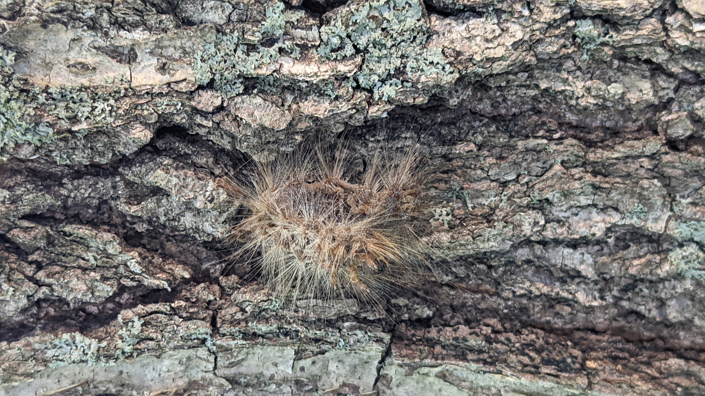
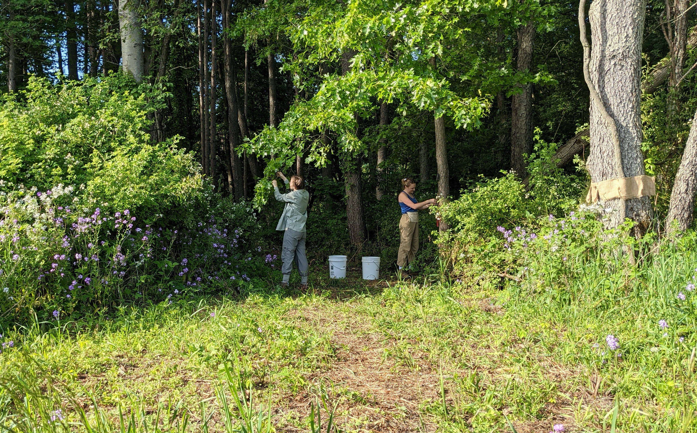

And with the last carload of supplies unpacked on UChicago campus, that wraps up my first field season! A huge thank you to my advisor Greg Dwyer, Alison Hunter, Caroline Chael, and the staff at Kellogg Biological Station for their support.

During this field season I piloted a new experimental protocol for creating articial epizootics (epidemics in animals) across a range of initial conditions to see how pathogen competition would be affected. There's still a lot of data to process, but it looks like an extremely successful season!

A *Lymantria dispar* caterpillar infected with the fatal, species-specific fungus *Entomophaga maimaiga* on the trunk of a red oak tree. The 'frosted flake' appearance of the cadaver is due to the presence of conidia, infectious spores that are airborne and can float to infect additional caterpillars. Fungal dynamics are strongly driven by weather-- the drought in Michigan seems to have restricted fungal success until quite late in the season.

To sample from each treatment, Caroline and I brought individual cups to the field that we used to scoop up caterpillars. The caterpillars were brought back to the lab and checked for death, where they were then autopsied to determine the presence of pathogens. In this way, we were able to track infection over time, data we can use to build mathematical models.

